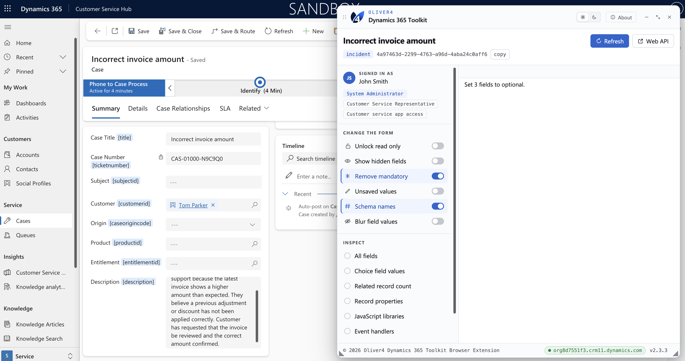
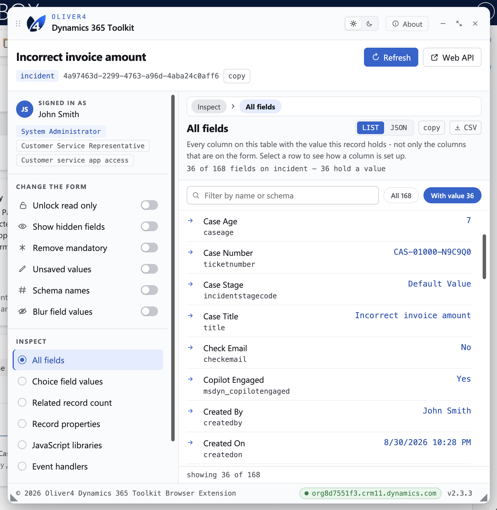
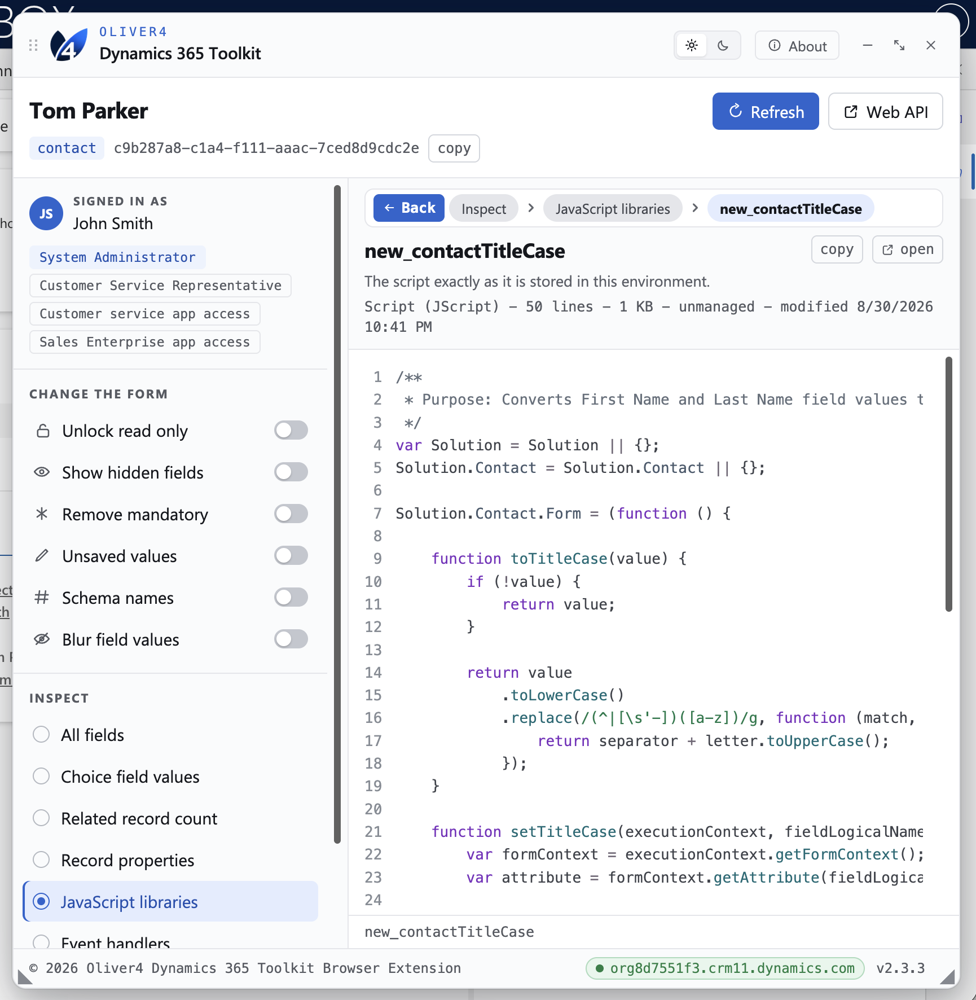

# Oliver 4 D365 Toolkit

[www.oliver4-devtools.com](https://www.oliver4-devtools.com/)

Developer tools for Dynamics 365 model-driven apps, packaged as an unpacked
Chrome/Edge browser extension - v2.3.3.

`toolkit/oliver4-toolkit.js` is the toolkit itself. Everything else in this
repo is the extension shell around it: a background service worker, the
toolbar icons, and the manifest.

## Install

Not on the Chrome Web Store, so it is loaded unpacked. Nothing is downloaded
and nothing is built.

**Chrome**

1. Go to `chrome://extensions`.
2. Turn **Developer mode** on, top right.
3. **Load unpacked**, and pick this repository's folder (the one holding
   `manifest.json`).
4. Pin it: the jigsaw icon in the toolbar, then the pin beside **Oliver 4 D365
   Toolkit**.

**Edge**

1. Go to `edge://extensions`.
2. Turn **Developer mode** on, bottom left.
3. **Load unpacked**, and pick this folder.
4. Pin it from the extensions button in the toolbar.

Chrome or Edge 111 or later. Both browsers can have the extension loaded at
the same time from this same folder.

## Using it

Open a model-driven app record and click the icon. Click it again to close the
panel - the panel's own close button does the same thing. Toggle state
survives closing and reopening the panel.

The icon is greyed out on anything that is not a Dynamics host, so it is a
signal as well as a button. If a click fails, the icon takes a red `!` badge;
the reason is in the service worker console, reached from **Service worker**
on the extension's card on the extensions page.

## Screenshots







## What is in the folder

```
manifest.json      the extension, at version 2.3.3
background.js      the shell: click to inject, host matching, icon theme
offscreen.html/.js reads prefers-color-scheme, which a service worker cannot
toolkit/           oliver4-toolkit.js, the toolkit itself
icons/             the mark at 16, 32, 48 and 128, in both colourways
```

## How it works

A click injects `toolkit/oliver4-toolkit.js` into the page's **main world**,
which is the part that matters: `Xrm` belongs to the page, and a normal
content script runs in an isolated world that cannot see it. Injection
targets the top frame only - the toolkit hoists itself to `window.top` and
walks the frame tree from there, so it still finds a form hosted in a session
iframe.

Clicking again removes the panel element, which is what the panel's own close
button does. State the toolkit keeps on `window.__oliver4D365Toolkit` is left
alone.

## Keeping it current

**A new toolkit version.** Two steps:

1. Copy the new file over `toolkit/oliver4-toolkit.js`.
2. Set both `version` and `version_name` in `manifest.json` to whatever the
   new toolkit's own `VERSION` reads. `version` is digits only and
   `version_name` carries the `v`, so a toolkit that says `v2.4.0` means
   `"version": "2.4.0"` and `"version_name": "v2.4.0"`. Then press **Reload**
   on the extension's card.

**Another host.** Add the match pattern to `host_permissions` in
`manifest.json` and reload. That is the only place to change it:
`background.js` reads the list back out of the manifest, so the icon lights
up on the new host without a second edit.

## Permissions

There is no `tabs` permission, no storage, and nothing leaves the browser. The
extension makes no network calls at all - the toolkit ships inside it.

The panel is gated on System Administrator membership. That gate is a guard
against accidental use, not a security control - Dataverse still enforces the
user's real privileges on every call.

## Worth knowing

- **The extension ID is derived from this folder's path.** Move or rename the
  folder and Chrome treats it as a different extension: load it again and
  unpin the old one. Copy the folder to a second machine and it gets a
  different ID there, which does not matter unless you later want policy to
  name it.
- **No auto-update.** Unpacked extensions never update themselves. A new
  toolkit version means replacing the file and pressing Reload.
- **Developer mode.** Chrome shows a "Disable developer mode extensions"
  prompt on some startups; dismissing it leaves the extension running. Some
  managed devices block unpacked extensions or developer mode outright by
  policy, in which case this extension cannot be loaded on that device.
- **The theme mark updates on the next click**, not the moment the browser
  theme changes, because the probe is opened and closed per click rather than
  kept alive.

